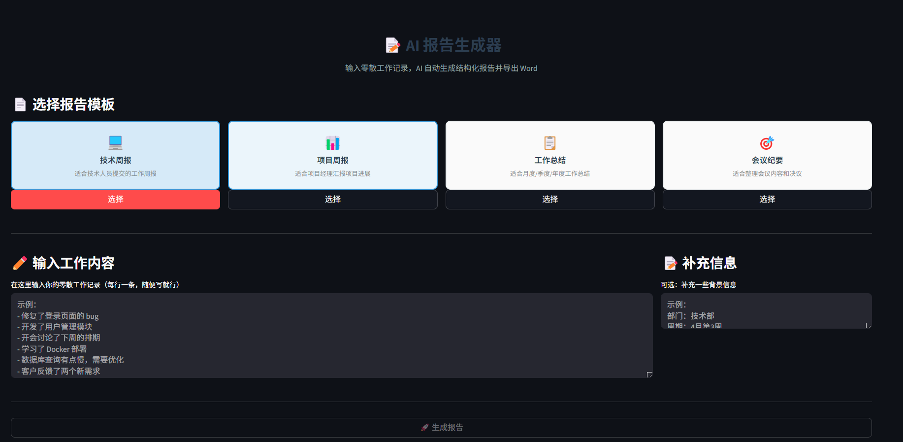

# 📝 AI 报告自动生成器

> 基于 AI 的智能报告生成工具，输入零散工作记录，一键生成结构化报告并导出 Word 文档。

## ✨ 功能特性

- 🧠 **智能整理** — AI 自动将零散工作记录归类为"完成项/进行中/问题与风险/下周计划"
- 📋 **多种模板** — 技术周报、项目周报、工作总结、会议纪要
- 📄 **一键导出 Word** — 生成带格式排版的 .docx 文件（标题、表格、加粗等）
- 👁️ **实时预览** — 生成后可预览报告内容，满意了再导出
- ✍️ **自动润色** — AI 自动补充描述、优化措辞，让报告更专业

## 🛠 技术栈

| 技术 | 用途 |
|------|------|
| DeepSeek API | AI 内容生成与整理 |
| python-docx | Word 文档生成与排版 |
| Streamlit | Web 界面框架 |
| python-dotenv | 环境变量管理 |

## 🚀 快速开始

### 1. 克隆项目

```bash
git clone https://github.com/SsllF8/ai-report-generator.git
cd ai-report-generator
```

### 2. 安装依赖

```bash
pip install -r requirements.txt
```

### 3. 配置环境变量

```bash
copy .env.example .env
```

填入你的 DeepSeek API Key（[申请地址](https://platform.deepseek.com/)）。

### 4. 运行

```bash
streamlit run app.py
```

或者双击 `启动应用.bat`。

## 📖 使用方法

1. 选择报告模板（技术周报 / 项目周报 / 工作总结 / 会议纪要）
2. 在文本框中输入零散的工作记录
3. 填写报告标题和作者姓名
4. 点击「✨ 生成报告」
5. 预览生成的报告内容
6. 满意后点击「📄 导出 Word」下载 .docx 文件

## 📸 系统界面



## 🔧 项目结构

```
ai-report-generator/
├── app.py              # Streamlit 主界面
├── report_generator.py # AI 报告生成模块
├── doc_exporter.py     # Word 文档导出模块
├── requirements.txt    # Python 依赖
├── .env.example        # 环境变量模板
├── 启动应用.bat         # Windows 启动脚本
└── screenshots/        # 项目截图
```

## 📄 License

MIT
